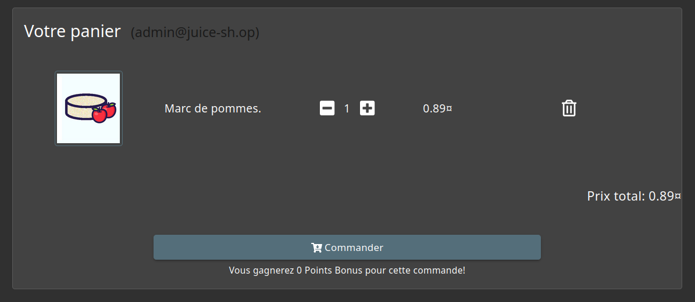
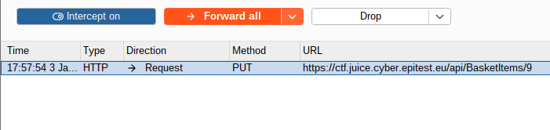
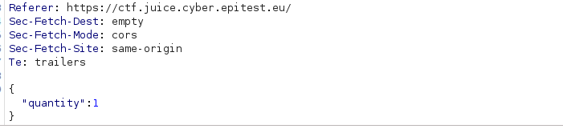
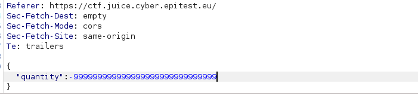
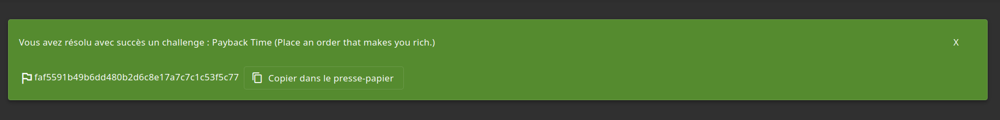

# Improper input validation - Difficulté 3 - Payback Time
## Description 

Cette vulnérabilité de la catégorie **Improper input validation** permet à un utilisateur de passer une commande au total négatif pour ne pas payer la commande et par conséquent en gagner.

## Méthodologie

1 - Préparation
- Navigation sur le site OWASP Juice Shop sur la page d’accueil.
- Ajout d’un article au panier.
- Passage à l’étape pour **modifier** le **nombre d’articles** dans le panier.

2 - Interception
- Interception de la requête GET qui affiche les articles dans le panier avec BurpSuite.

3 - Modification
- Laisser passer la requête GET.
- Modification ensuite de la requête PUT qui modifie le **nombre** d’articles.
- Entrer un nombre **négatif** dans le champ "**Quantity**".

 ## Vulnérabilité

- **Type** : Business Logic Flaw 
- **OWASP Top 10** : A04:2021 – Insecure Design
- **CWE** : CWE-840 – Business Logic Errors
- **Gravité** : élevée

 ##  Risques et conséquences 

 - Perte financière pour l'entreprise.
 - Enrichissement illimité sur la plateforme.
 - Perte de confiance des utilisateurs. 
 - Dégradation de la réputation.

 ## Outils utilisés

- Navigateur web (Firefox)
- BurpSuite

 ## Stratégies d'atténuations 

- Surveiller les transactions anormales pour détecter les commandes suspectes.
- Ne jamais accepter un montant négatif côté serveur.

## Preuves 

Panier au départ

Requête PUT 

Champ **Quantity**

Champ **Quantity** modifié

Validation

## Conclusion

Cette vulnérabilité révèle l’importance de mettre en place un véritable système de surveillance des commandes effectuées sur la plateforme afin de prévenir un potentiel problème financier important.