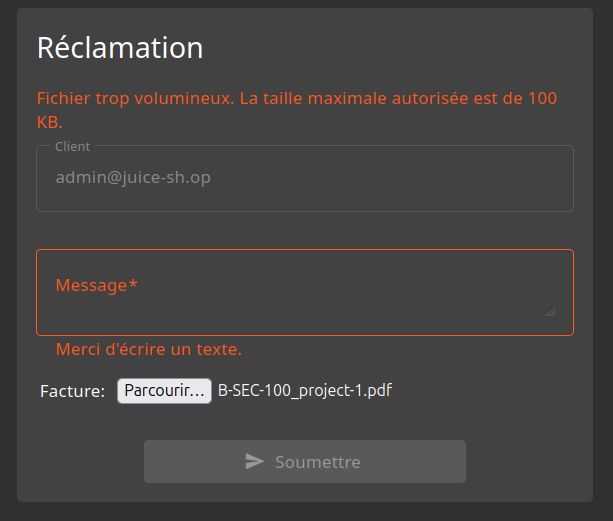
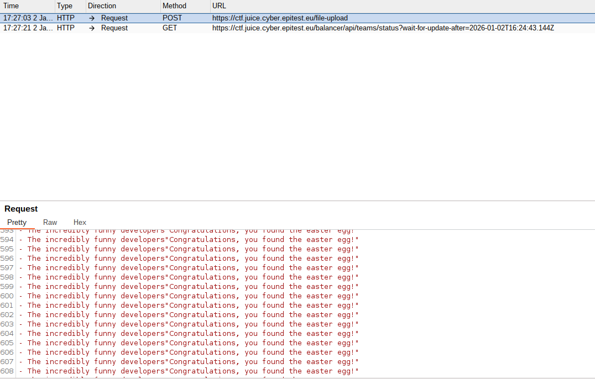

# Improper input validation - Difficulté 3 - Upload Size

## Description 

Cette vulnérabilité de la catégorie **Improper input validation** permet à un utilisateur d'envoyer au serveur un fichier de taille plus élevé que la limite du site autorisé.

## Méthodologie

1 - Préparation 
 - Navigation sur le site OWASP Juice Shop jusqu'à l'onglet pour faire réclamation. Il est demandé ici de télécharger un fichier de type PDF ou ZIP et que la taille de ce fichier ne dépasse pas 100 KO.

2 - Interception

 - Téléchargement d'un fichier valide, donc inférieur à 100 KO. Interception de la requête avec Burpsuite.

3 - Modification
 - Repérage du contenu du fichier présent dans la requête. Il suffit à présent de copier-coller un contenu supérieur à la limite autorisée par le site et d'envoyer la requête.

 ## Vulnérabilité

- **Type** : Upload Size 
- **OWASP Top 10** : A05:2021 – Security Misconfiguration
- **CWE** : CWE-674 – Uncontrolled Resource Consumption
- **Gravité** : élevé

 ##  Risques et conséquences 

 - Saturation du serveur et impact sur la disponibilité (DoS)
 - Augmentation des ressources consommées (CPU, mémoire, stockage) pouvant mener à un dysfonctionnement.

 ## Outils utilisés

- Navigateur web (Firefox)
- BurpSuite

 ## Stratégies d'atténuations 

- Rejeter automatiquement les fichiers dépassant la limite avec un message d’erreur clair, coté serveur.
- Surveiller l’utilisation des ressources pour détecter les uploads volumineux abusifs et bloquer l'activité qui cause problème.

## Preuves 

Rejet côté client d'un fichier trop volumineux

Modification et augmentation du contenu du fichier dans la requète (copier - coller)

## Conclusion

Cette vulnérabilité révèle l'importance de surveiller quels fichiers sont envoyés au serveur (type, taille, etc.) pour prévenir des attaques pouvant compromettre son bon fonctionnement.