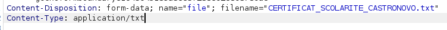
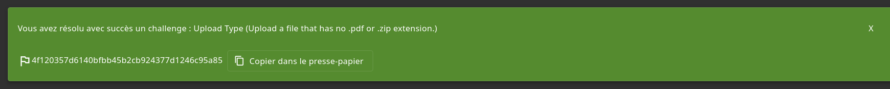

# Improper input validation - Difficulté 3 - Upload Type

## Description 

Cette vulnérabilité de la catégorie **Improper input validation** permet à un utilisateur d'envoyer au serveur un fichier qui possède une extension non autorisé par le serveur.

## Méthodologie

1 - Préparation 
 - Navigation sur le site OWASP Juice Shop jusqu'à l'onglet pour faire réclamation. Il est demandé ici de télécharger un fichier de type PDF ou ZIP et que la taille de ce fichier ne dépasse pas 100 KO.

2 - Interception

 - Téléchargement d'un fichier valide, de type PDF ou ZIP.

3 - Modification
 - Changement de l'extension valide par une extension non accepté en temps normal.

 ## Vulnérabilité

- **Type** : Improper Input Validation 
- **OWASP Top 10** : A03:2021 – Injection
- **CWE** : CWE-434 – Unrestricted Upload of File with Dangerous Type
- **Gravité** : élevé

 ##  Risques et conséquences 

 - Envoi de fichiers non autorisés sur le serveur.
 - Possibilité d’upload de fichiers malveillants.

 ## Outils utilisés

- Navigateur web (Firefox)
- BurpSuite

 ## Stratégies d'atténuations 

- Rejeter automatiquement les fichiers ne conrrespondant pas au type autorisé.
- Toujours verifier côté serveur quel fichier est reçu.

## Preuves 

PDF envoyé mais on modifie en txt

Fichier accepté

## Conclusion

Cette vulnérabilité révèle l'importance de surveiller quels fichiers sont envoyés au serveur (type, taille, etc.) pour prévenir des attaques pouvant compromettre son bon fonctionnement.