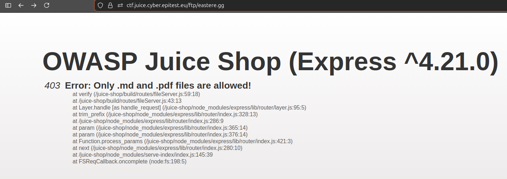
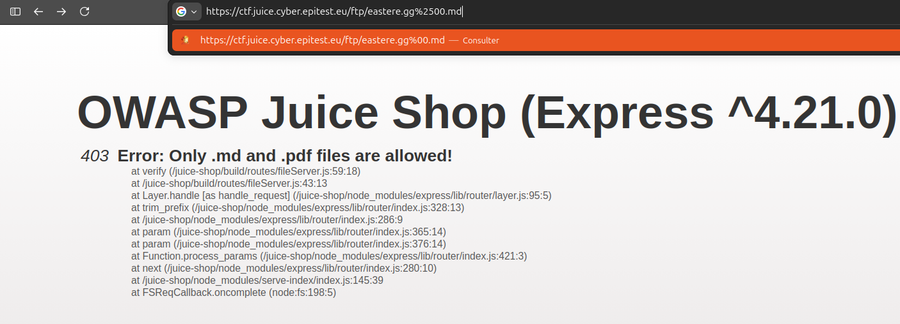
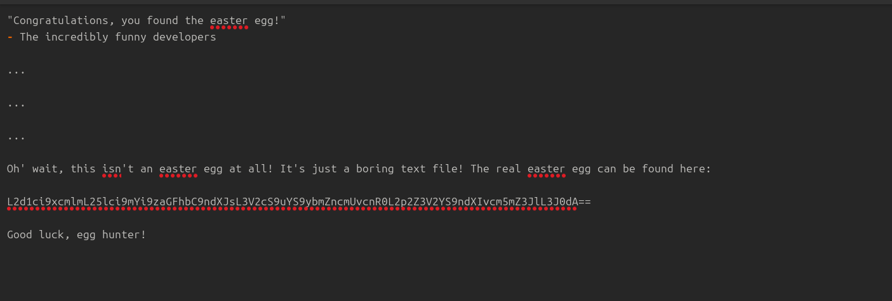

# Improper input validation - Difficulté 4 - Poison Null Byte

## Description 

Cette vulnérabilité de la catégorie **Improper input validation** permet à un utilisateur de télécharger des fichiers présent sur le site dont il n'est pas censé ni avoir accès ni pouvoir le faire.

## Méthodologie

1 - Préparation 
 - Navigation sur le site OWASP Juice Shop
 - Grâce à la faille confidential document, nous savons maintenant qu'un dossier FTP est présent sur le site alors qu'il ne devrait pas, et ce dossier contient de nombreux fichiers confidentiels.
 - Lorsqu'on clique sur des fichiers pour y avoir accès , si l'extension du fichier est en .md ou en .pdf, nous y avons accès , mais si ce n'est pas le cas, le site nous dit bien que nous n'avons accès qu'à ce type de document.

2 - Recherche

 - J'ai recherché ensuite sur internet l'explication d'une attaque de type Poison Null Byte et savoir comment elle fonctionnait. Je me suis renseigné à partir du nom du challenge.

3 - Execution 
 - J'ai ensuite introduit dans l'URL au bon endroit "%2500" pour effectuer l'attaque et pouvoir passer le filtre des extensions.

```https://ctf.juice.cyber.epitest.eu/ftp/eastere.gg%2500.pdf```


 ## Vulnérabilité

- **Type** : Poison Null Byte 
- **OWASP Top 10** : A03:2021 – Injection
- **Gravité** : Très élevé


 ##  Risques et conséquences 

 - Accès a des documents et informations confidentielles.
 - Fuite de données
 - Dégradation de la sécurité du site.


 ## Outils utilisés

- Navigateur web (Firefox)

 ## Stratégies d'atténuations 

- Renforcer la sécurité du filtre côté serveur. 
- Vérifier strictement l'extension du fichier reçu et si il contient des caractères spéciaux non autorisés comme "%".

## Preuves 

Rejet de l'accès à un fichier non **.md** ou **.pdf**


Modification et augmentation de la requète avec " %2500"


Accès au fichier


## Conclusion

Cette faille montre bien l'importance de vérifier côté serveur l'URL qui est reçue, qu'est-ce qu'elle contient. Corriger cette vulnérabilité permet de protéger l'accès à des fichiers privés et confidentiels, d'éviter des fuites de données et renforcer la sécurité globale de l'application.