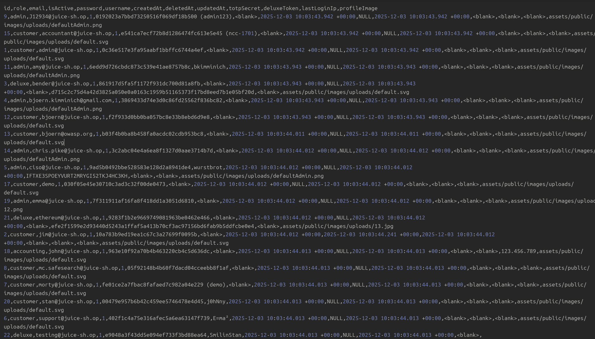
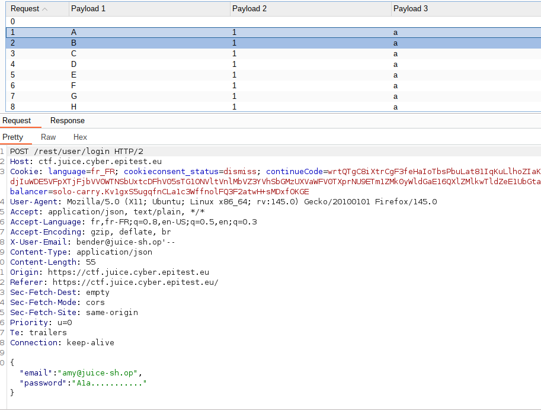
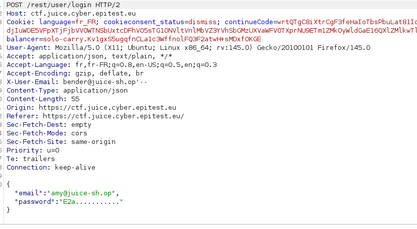

# Sensitive Data Exposure - Difficulté 3 - Login Amy

## Description 

Cette vulnérabilité de la catégorie **Sensitive Data Exposure** permet à un utilisateur d’accéder à des informations confidentielles d’utilisateurs suite à une mauvaise protection des données sensibles.

## Méthodologie

### Première approche
--- 
1 - Analyse
 - Ici le site OWASP Juice Shop nous oriente vers un site qui présente différentes manières de créer un mot de passe robuste.

 - Malheureusement Amy n’a changé que les caractères du mot de passe d’exemple présent sur le site, il est de type "MajusculeChiffreMinuscule...........".

2 - Brut Force
 - Utilisation de la partie Intruder de Burp pour tester toutes les combinaisons de "Majuscule + Chiffre + minuscule + ...........".

 - Pour une attente moindre, j’ai utilisé le Turbo Intruder qui est une extension intégrée dans Burp qui ignore un grand nombre de paramètres, rendant les requêtes et réponses plus rapides.

3 - Exploitation
 - Après avoir obtenu une réponse au code 201 sur le mot de passe "K1f...........", il ne restait plus qu’à le rentrer dans la page login d’Amy pour se connecter avec son compte.
---
### Seconde approche 
---
1 - Injection SQL
 - Dump de la base de données pour récupérer tous les hash des mots de passe des utilisateurs enregistrés.

2 - word list
 - Utilisation de hashcat avec une word list pour essayer de déchiffrer les hash trouvés, mais échec.

3 - Réussite
 - Mot de passe d'Amy trouvé suite à l'utilisation d'une word list plus conséquente.

 ## Vulnérabilité

- **Type** : Sensitive Data Exposure
- **OWASP Top 10** : A02:2021 – Sensitive Data Exposure
 - **CWE** : CWE-200 – Exposure of Sensitive Information
 - **Gravité** : élevé

 ##  Risques et conséquences 

 - Usurpation d'identité
- Réutilisation des identifiants (Il y a de grandes chances pour qu'elle ait utilisé ces identifiants sur d'autres plateformes.)
- Accès à des informations privées de type bancaires ou l'adresse postale.

 ## Outils utilisés

- Navigateur web (Firefox)
- BurpSuite
- SQLmap
- hashcat

 ## Stratégies d'atténuations 

-  Détecter et limiter les tentatives de connexions trop nombreuses et consécutives (par un CAPTCHA par exemple).
- Introduire une authentification à deux facteurs.
- Ne laisser aucun indice sur la façon dont un mot de passe utilisateurs peut être construit.
- En cas de fuite, limiter le nombre d’informations accessibles par l’attaquant.

## Preuves 

Résultat du Dump de la table Users

Début du Brut Force des combinaisons

Exemple de l'avancement de l'attaque

## Conclusion

Cette vulnérabilité montre que l"exposition maladroite d'informations sensible peut nuire considérablement à la protection des utilisateurs, à la sécurité du site et des données.